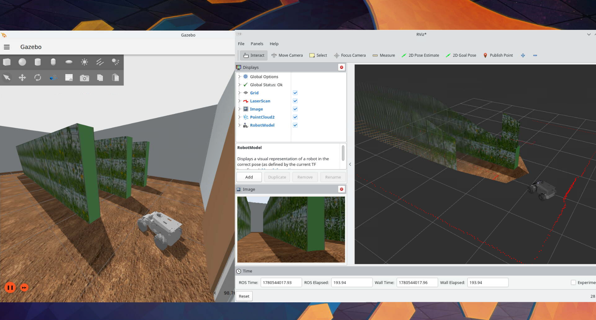

# rosorin_sim_ws — AgriFollower Simulation Workspace

<p align="center">
  
</p>
<p align="center">
  <sub>Ignition Gazebo 온실 시뮬레이션 — 토마토 줄 사이를 주행하는 ROSOrin Mecanum(좌)과 RViz 센서 뷰(우)</sub>
</p>

> **AgriFollower** 프로젝트의 일환.
> AgriFollower는 온실에서 수확 작업자를 따라다니며 수확물을 운반해 작업 피로를 줄이는
> **수확 보조 자율 운반 로봇**을 만드는 프로젝트다. 이 저장소는 그중 **시뮬레이션 + 강화학습(RL) 워크스페이스**로,
> 실 하드웨어 없이 데스크탑/서버에서 **Ignition Gazebo**로 정책을 학습하고 검증한다.

ROSOrin(Hiwonder, 매카넘 휠) 로봇을 Ignition Gazebo 온실에 띄우고,
**작업자(타겟)를 일정 거리로 추종하며 주변 장애물에 맞춰 최적 자세를 잡는 주행 정책**을 RL로 학습하는 것이 목표다.
(단순 통로 주행/내비게이션이 아니라 **타겟 추종**이 핵심.)

RL 설계는 [`docs/rl_design/0_project_proposal.md`](docs/rl_design/0_project_proposal.md)(개요·알고리즘·Sim-to-Real)와
상태/보상/시나리오 세부 노트(구체 수치·수식의 단일 출처)에 정리되어 있다.

## 핵심 정보
| 항목 | 내용 |
|------|------|
| 시뮬레이터 | **Ignition Gazebo Fortress 6.x** (Gazebo Classic 아님) · 렌더 `ogre2`(GPU) |
| 로봇 | ROSOrin Mecanum (4 매카넘 휠, 3-DOF 홀로노믹) |
| 센서 | 2D LiDAR(MS200) · RGB-D 카메라(aurora, `rgbd_camera` → `/depth_cam/*`) · IMU |
| RL 과제 | 작업자 추종 (거리 유지 + 장애물 회피 + 매카넘 최적 자세) |
| RL 스택(예정) | Gymnasium + Stable-Baselines3 (SAC 1순위 / PPO 베이스라인) |
| 환경 | Docker(`nvidia-egl-desktop-ros2:humble`, noVNC) · Ubuntu 22.04 · ROS 2 Humble · Python 3.10 |

## 실행 환경
이 ws는 **Docker 컨테이너 안에서 GPU 가속 렌더(`ogre2`)** 로 구동한다. (CPU 소프트웨어 렌더 아님.)
- 컨테이너 이미지: `nvidia-egl-desktop-ros2:humble` (https://github.com/atinfinity/nvidia-egl-desktop-ros2 기반)
- 접속: noVNC `http://<host>:6080` (컨테이너 8080 → 호스트 6080)
- 호스트 `~/rosorin_sim_ws`가 컨테이너 동일 경로로 마운트됨
- 소프트웨어: Ubuntu 22.04 / ROS 2 Humble / Python 3.10 / Ignition Gazebo Fortress 6.x

```bash
# 컨테이너 실행 (호스트에서) — <...> 자리는 본인 값으로 채울 것
docker run -d \
  --name ros2_gpu_vnc \
  --gpus all \
  -e NVIDIA_DRIVER_CAPABILITIES=all \
  --shm-size=16g \
  --pid=host \
  -e SIZEW=1920 -e SIZEH=1080 \
  -e PASSWD=<YOUR_VNC_PASSWORD> -e BASIC_AUTH_PASSWORD=<YOUR_BASIC_AUTH_PASSWORD> \
  -e NOVNC_ENABLE=true \
  -p 6080:8080 \
  -v ~/rosorin_sim_ws:/home/user/rosorin_sim_ws \
  nvidia-egl-desktop-ros2:humble
```
GPU/부하 상세는 [`docs/hardware_requirements.md`](docs/hardware_requirements.md), 최초 세팅 절차는 [`docs/setup_process.md`](docs/setup_process.md).

## 설치 & 빌드 (컨테이너 안에서)
```bash
# 1. clone (또는 호스트 마운트 경로 사용)
git clone <repo-url> ~/rosorin_sim_ws
cd ~/rosorin_sim_ws

# 2. 제조사 코드 복원 (필수) — 아래 "제조사 코드 & 에셋" 참고
#    src/simulations/(robot_gazebo·rosorin_description)는 repo에 없음.
#    제조사 simulations.zip 내용을 src/simulations/ 에 풀어넣어야 빌드/실행 가능.

# 3. 빌드
colcon build --symlink-install

# 4. 소싱 (새 터미널마다)
source /opt/ros/humble/setup.bash
source ~/rosorin_sim_ws/install/setup.bash
source ~/rosorin_sim_ws/.typerc
```
런타임 패키지(`ros-humble-ros-ign-gazebo`, `ign-ros2-control`, `joint-state-publisher`, `ros-gz-bridge`)
설치는 `docs/setup_process.md` 참고.

## 실행
```bash
# 제조사 예제 world
ros2 launch robot_gazebo worlds.launch.py        # empty.sdf
ros2 launch robot_gazebo room_worlds.launch.py   # robocup_home.sdf (데모 메시 복원 필요)

# 온실 환경 (RL 대상) — 1.83× 스케일 로봇 포크(greenhouse_sim/urdf/)를 스폰
ros2 launch greenhouse_sim greenhouse.launch.py

# RL 학습용 전체 스택 (온실 + 이동 작업자 + 타겟 특징 + 리셋 브리지)
ros2 launch rosorin_rl rl_sim.launch.py                 # GUI (검증용)
ros2 launch rosorin_rl rl_sim.launch.py headless:=true  # 서버만 (학습 처리량↑)

# 학습 / 평가 (rl_sim 이 떠 있는 상태에서, 별도 터미널)
ros2 run rosorin_rl train_sac --timesteps 200000        # SAC (--algo ppo 가능)
ros2 run rosorin_rl eval_policy --model src/rosorin_rl/models/sac_follow_final.zip

# 키보드 teleop (매카넘 vx/vy/ω)
ros2 run robot_gazebo teleop_key_control
```
- RL 코드 이해·검증 체크리스트·보상 튜닝은 [`docs/rl_code_guide.md`](docs/rl_code_guide.md).

## 온실 world 재생성
레이아웃(줄 수·작물 수·통로폭 등)을 바꾸려면 `src/greenhouse_sim/scripts/gen_greenhouse_world.py` 상단 파라미터 수정 후:
```bash
python3 src/greenhouse_sim/scripts/gen_greenhouse_world.py   # worlds/greenhouse.sdf 재생성
colcon build --symlink-install --packages-select greenhouse_sim
```
- world는 **통로 입구가 원점(0,0)** 에 오도록 생성 → `robot_gazebo`의 `(-x 0 -y 0)` 스폰이 입구·+x 방향과 일치.
- 잎 텍스처는 `media/materials/textures/*.jpg`(24장)를 패널에 랜덤 배치(`RANDOM_SEED`로 재현).

## 토픽 인터페이스 (`ros_gz_bridge`)
| 토픽 | 타입 | 방향 |
|------|------|------|
| `/controller/cmd_vel` | `geometry_msgs/Twist` | ROS→IGN |
| `/odom` | `nav_msgs/Odometry` | IGN→ROS |
| `/odom/tf` (→ `tf`) | `tf2_msgs/TFMessage` | IGN→ROS |
| `/clock` | `rosgraph_msgs/Clock` | IGN→ROS |
| `/joint_states` | `sensor_msgs/JointState` | IGN→ROS |
| `/scan` · `/scan/points` | `LaserScan` · `PointCloud2` | IGN→ROS |
| `/imu` | `sensor_msgs/Imu` | IGN→ROS |
| `/depth_cam/image` | `sensor_msgs/Image` (RGB) | IGN→ROS |
| `/depth_cam/depth_image` | `sensor_msgs/Image` (32FC1) | IGN→ROS |
| `/depth_cam/points` | `sensor_msgs/PointCloud2` | IGN→ROS |
| `/depth_cam/camera_info` | `sensor_msgs/CameraInfo` | IGN→ROS |

RL 스택(`rosorin_rl/launch/rl_sim.launch.py`)이 추가하는 인터페이스:
| 토픽/서비스 | 타입 | 발행/제공 |
|------|------|------|
| `/target/features` | `std_msgs/Float32MultiArray` `[x_norm,y_norm,d_t,θ_t,visible]` | `target_feature` 노드 (ground truth + 노이즈 3%) |
| `/worker/pose` | `geometry_msgs/PoseStamped` | `target_controller` 노드 (작업자 키네마틱 pose) |
| `/worker/reset` | `std_srvs/Empty` (서비스) | `target_controller` — 에피소드 리셋 |
| `/world/greenhouse_world/dynamic_pose/info` | `tf2_msgs/TFMessage` | RL 브리지 (동적 모델 ground-truth pose) |
| `/world/greenhouse_world/set_pose` | `ros_gz_interfaces/srv/SetEntityPose` (서비스) | RL 브리지 — 텔레포트(리셋·작업자 이동) |

- `nav:=true`로 띄우면 `/controller/cmd_vel`가 `/cmd_vel`로 리매핑됨. 스폰 엔티티 이름은 `robot`(로봇)·`worker_target`(작업자).
- `/depth_cam/*`는 RGB-D(`rgbd_camera`) — greenhouse 스택의 브리지 포크(`greenhouse_sim/launch/ros_ign_bridge.launch.py`) 기준. frame_id `camera_link0`.
- 센서 스펙·구동 플러그인 상세는 [`docs/environment.md`](docs/environment.md).
- ⚠️ 벤더 MecanumDrive 의 `linear.y` 부호가 REP-103 과 반대 (실측) — RL env 가 보정. teleop 으로 횡이동 시 유의. 상세 [`docs/rl_code_guide.md`](docs/rl_code_guide.md) §5.

## 패키지 구조 (`src/`)
```
rosorin_sim_ws/
├── docs/                              # 상세 문서 (rl_design/·roadmap·environment 등 — 아래 링크)
└── src/
    ├── simulations/                   # ⚠️ 제조사 monorepo — repo에 미포함. zip에서 복원 ("제조사 코드 & 에셋")
    │   ├── robot_gazebo/              #   Ignition world·로봇 spawn·브리지·ros2_control·teleop (시뮬 진입점)
    │   └── rosorin_description/       #   로봇 URDF/Xacro/메시
    ├── greenhouse_sim/                # (우리) RL용 토마토 온실 world 패키지 (gen_greenhouse_world.py로 생성)
    └── rosorin_rl/                    # (우리) RL 환경/알고리즘 — Gym Env·보상·작업자 노드·SAC/PPO 학습
        ├── rosorin_rl/                #   follow_env.py(Gym⇄ROS)·obs_pipeline·reward·target_*_node·train_sac·eval_policy
        ├── config/rl_params.yaml      #   모든 튜너블 (보상 계수·임계값·하이퍼파라미터)
        ├── launch/rl_sim.launch.py    #   온실 + 작업자 + RL 브리지 통합 런치
        └── worlds_models/             #   worker_target.sdf (작업자 원기둥)
```
> `src/simulations/`는 제조사 monorepo이므로 **수정하지 않으며 repo에도 포함하지 않는다**(라이선스·업데이트 충돌 방지). 우리 코드는 별도 패키지(`greenhouse_sim`/`rosorin_rl`)로 둔다.

## 제조사 코드 & 에셋 — repo에서 제외됨
이 repo에는 **우리가 작성한 코드만** 포함한다(Apache-2.0, 아래 "라이선스"). 다음은 **제조사(Hiwonder) 자산이라 포함하지 않는다.**

| 제외 대상 | 내용 | 없을 때 영향 |
|-----------|------|--------------|
| `src/simulations/` 전체 | 제조사 ROSOrin monorepo (`robot_gazebo`·`rosorin_description`: world·spawn·브리지·URDF·메시) | **빌드/실행 불가** — `greenhouse_sim`이 `robot_gazebo`의 spawn·bridge 런치를 재사용하므로 필수 |

**복원 방법:** 제조사 `simulations.zip`(입수 절차: `docs/setup_process.md`)의 내용을 `src/simulations/` 아래에 풀어넣은 뒤 `colcon build --symlink-install`.
복원하면 무거운 본체/데모 메시까지 함께 들어오므로 로봇 시각 렌더도 정상 동작한다.

> 텍스처(`greenhouse_sim/media/.../*.jpg`)는 **우리 자체 에셋**이라 repo에 포함한다.

## 문서
- [`docs/runbook.md`](docs/runbook.md) — **런북: 상황별 실행 명령어 모음** (학습 시작/재개·모니터링·종료 후 확인·평가 — 복사해서 바로 실행)
- [`docs/rl_design/`](docs/rl_design/) — **RL 설계 문서** 모음
  - [`0_project_proposal.md`](docs/rl_design/0_project_proposal.md) — RL 설계 개요 (목적·파이프라인·MDP 개요, SAC·PPO, Sim-to-Real)
  - [`rl_state_space.md`](docs/rl_design/rl_state_space.md) · [`rl_reward_function.md`](docs/rl_design/rl_reward_function.md) · [`rl_train_senarioes.md`](docs/rl_design/rl_train_senarioes.md) — 상태/보상/학습 시나리오 세부 노트 (**구체 수치·수식의 단일 출처**)
- [`docs/rl_code_guide.md`](docs/rl_code_guide.md) — **RL 코드 가이드** (아키텍처 맵·검증 체크리스트·보상 튜닝 표·TensorBoard 모니터링·함정)
- [`docs/roadmap.md`](docs/roadmap.md) — 진행 상황 & 단계별 실행 계획 (검증 → sim 보강 → `rosorin_rl` → 학습 → Sim-to-Real)
- [`docs/setup_process.md`](docs/setup_process.md) — Ignition 세팅 성공 기록 (설치 절차)
- [`docs/troubleshooting.md`](docs/troubleshooting.md) — 치명적 오류 기록부 (원인·해결; 예: depth_cam 대각선 회색)
- [`docs/environment.md`](docs/environment.md) — Ignition 스택 · `.typerc` · 토픽 · 센서 스펙
- [`docs/hardware_requirements.md`](docs/hardware_requirements.md) — Docker/GPU 환경 · 학습 처리량

## 라이선스
- 이 repo에 포함된 **우리 코드/문서/에셋은 [Apache License 2.0](LICENSE)** (`LICENSE`·`NOTICE` 참고).
- **`src/simulations/`(제조사 Hiwonder monorepo)는 포함하지 않으며 Apache-2.0이 적용되지 않는다.** 제조사가 라이선스를 명시하지 않은 제3자 코드이므로 재배포하지 않고, 사용자가 제조사 `simulations.zip`에서 직접 받아 사용한다(권리는 제조사 보유).

## 유의
- **Ignition 전용.** Gazebo Classic 문법(`gazebo_ros`, `spawn_entity.py`, OGRE `.material`, `GAZEBO_RESOURCE_PATH`, `/reset_world`)을 섞지 말 것.
- 새 터미널마다 소싱(`install/setup.bash` + `.typerc`), 코드 변경 후 `colcon build`.
